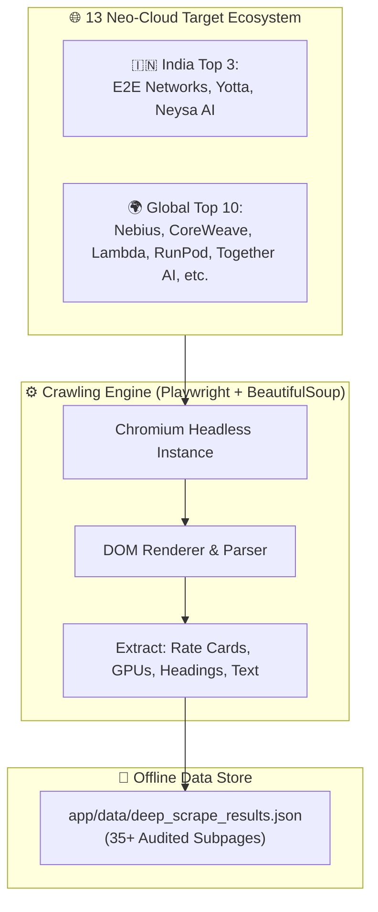
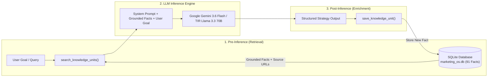
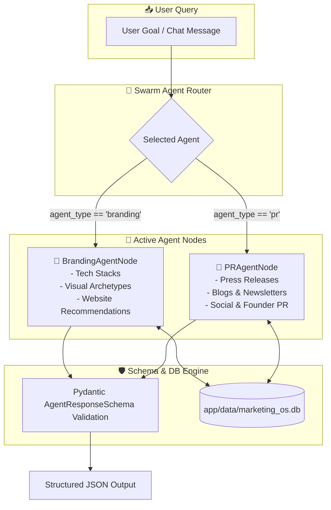
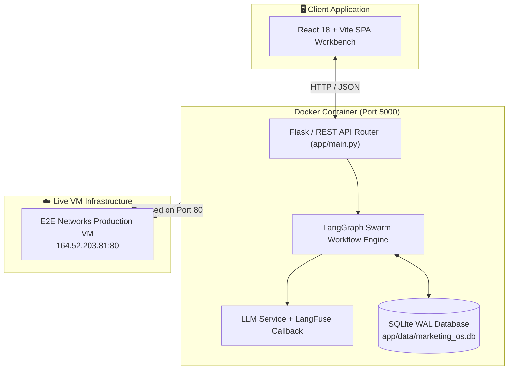
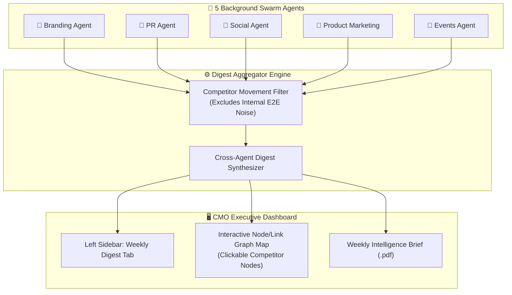
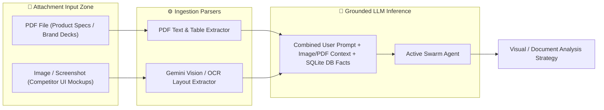
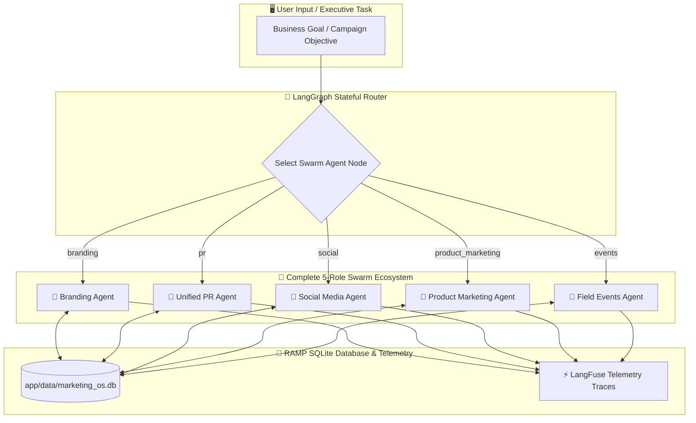

# 📐 Master System Design Document (Phases 1 – 8)
## Marketing OS v2.0 for E2E Networks & TIR AI Platform

> **Document Purpose**: Production-grade architectural blueprint detailing the end-to-end multi-agent intelligence ecosystem for E2E Networks. Formatted for Claude model ingestion, developer onboarding, and executive review.

---

## 📑 System Overview & Core Philosophy

**Marketing OS v2.0** is an enterprise-grade, governed multi-agent competitive intelligence platform built for **E2E Networks** (NSE: E2E) and its **TIR AI Platform**.

### Fundamental Architectural Principles:
1. **Strict Zero-Hallucination Grounding**: Every recommendation, rate card comparison, and PR counter-strategy is strictly backed by verifiable empirical facts in SQLite (`marketing_os.db`).
2. **Stateful Agent Swarm Orchestration**: Agents operate on a stateful **LangGraph State Machine** with dynamic handoffs and **LangFuse telemetry tracing**.
3. **Human-in-the-Loop Governance**: High-risk positioning moves or low-confidence decisions trigger an interactive CMO ratification banner.
4. **Modular Senior Engineering Layout**: A clean `app/` root package (`api/`, `core/`, `db/`, `graph/`, `agents/`, `services/`) with a React 18 + Vite SPA workbench.

---

## 🚩 Phase 1: Web Crawling & Multi-Page Scraping Infrastructure

### 1.1 Detailed Technical Steps:
1. **Target Ecosystem**: Audited **13 Neo-Cloud Target Organizations** (Top 10 Global + Top 3 India):
   - **India Top 3**: E2E Networks (Us), Yotta Data Services, Neysa AI.
   - **Global Top 10**: Together AI, RunPod, Lambda Labs, Nebius, CoreWeave, Crusoe Cloud, VAST Data, Voltage Park, Hyperstack, Foundry.
2. **Multi-Page Playwright Crawler (`scratch/deep_neo_cloud_scraper.py`)**:
   - Spawns Chromium Headless browser instances to navigate 35+ target subpages (`/pricing`, `/tir`, `/company`, `/products/*`, `/shakti-cloud`).
   - Extracts rendered DOM elements, headings (`h1`, `h2`, `h3`), hardware rate cards (`$6.99/hr`, `₹671/hr`), GPU hardware listings (`B200`, `H200`, `H100`, `L40S`), and technical text snippets.
3. **Context-Safe Data Aggregation**:
   - Saves raw JSON payloads to `app/data/deep_scrape_results.json` without polluting LLM prompt context window.

### 1.2 Mermaid Architecture Diagram:


---

## 🚩 Phase 2: RAMP Grounded SQLite Database Engine (`marketing_os.db`)

### 2.1 Detailed Technical Steps:
1. **Database Schema (`app/db/database.py`)**:
   - Configures SQLite in Write-Ahead Logging (WAL) mode (`PRAGMA journal_mode=WAL`).
   - `knowledge_units`: `(id, organization, knowledge_class, confidence, content, source_url, enriched_by, created_at)`.
   - `decisions`: `(id, goal_statement, selected_option, confidence, escalated, reasoning_source, rationale, risks, created_at)`.
2. **Grounded Database Seeding (`app/db/grounded_seed.py`)**:
   - Reads `deep_scrape_results.json` and seeds **91 100% grounded empirical facts** into `marketing_os.db`.
   - Every single fact explicitly records its primary `source_url` (e.g. `https://www.e2enetworks.com/pricing`, `https://yotta.com/shakti-cloud/`).
3. **Zero-Hallucination Pre/Post Inference Pipeline**:
   - Pre-inference: `search_knowledge_units(query, limit=5)` queries relevant facts before calling LLMs.
   - Post-inference: `save_knowledge_unit()` dynamically enriches synthesized agent decisions back into SQLite.

### 2.2 Mermaid Architecture Diagram:


---

## 🚩 Phase 3: Core Swarm Agent Nodes (`BrandingAgentNode` & `PRAgentNode`)

### 3.1 Detailed Technical Steps:
1. **🎨 Branding Agent Node (`app/agents/branding_agent.py`)**:
   - **Scope**: Competitor tech stacks, design systems, visual design archetypes (*Enterprise-Centric* vs *Developer-Focused* vs *Research-Focused*), website design recommendations.
   - Compares E2E Networks & TIR against global and Indian Neo-Cloud landing page structures.
2. **📰 Unified PR Agent Node (`app/agents/pr_agent.py`)**:
   - **Scope**: Combines 4 media vectors: Press Releases, Company Blogs/Newsletters, Social Media (`[LinkedIn]`, `[X/Twitter]`), and Founder PR (interviews, podcast transcripts).
   - Formulates counter-narratives and media positioning briefs.
3. **Pydantic Schema Validation (`app/core/schemas.py`)**:
   - Enforces Pydantic `AgentResponseSchema` validation on all agent outputs, guaranteeing valid JSON formatting.

### 3.2 Mermaid Architecture Diagram:


---

## 🚩 Phase 4: Production Senior Engineering Architecture & Deployment

### 4.1 Detailed Technical Steps:
1. **Modular Root Package Layout**:
   - `app/api`: REST API routes (`/api/run`, `/api/history`, `/api/health`).
   - `app/core`: Configuration (`config.py`), Pydantic schemas (`schemas.py`), primitives (`primitives.py`).
   - `app/db`: SQLite database layer (`database.py`, `grounded_seed.py`).
   - `app/graph`: LangGraph state machine (`state.py`, `workflow.py`, `handoffs.py`).
   - `app/agents`: Agent node implementations (`branding_agent.py`, `pr_agent.py`).
   - `app/services`: Unified LLM factory (`llm_service.py`) & LangFuse telemetry (`langfuse_service.py`).
2. **Automated Unit & Integration Test Suite (`tests/`)**:
   - 7 automated Pytest/Unittest cases testing SQLite operations, Pydantic validation, and API routes.
3. **Docker Container & Production VM Deployment**:
   - Multi-stage Dockerfile (Node 22 Slim frontend build + Python 3.11 Slim app runner).
   - Live production VM deployment at **[http://164.52.203.81](http://164.52.203.81)** (`HTTP 200 OK`).

### 4.2 Mermaid Architecture Diagram:


---

## 🚩 Phase 5: CMO Weekly Executive Digest & Visual Link Network UI

### 5.1 Detailed Technical Steps:
1. **Business Objective**: A CMO/CFO may only chat with 1 or 2 agents during the week. The Weekly Digest aggregates background intelligence across ALL 5 agents into a single executive dashboard.
2. **Competitor-Only Focus**: 100% focused on rival movements (Yotta, Neysa, Together AI, RunPod, Nebius, CoreWeave, etc.)—excluding internal E2E noise.
3. **Interactive Link Network Diagram**:
   - An interactive visual node/edge graph map on the React UI allowing the CMO to click on competitor nodes (e.g. *Nebius*, *RunPod*, *Yotta*) to inspect linked rate cards and news citations.
4. **Downloadable PDF Executive Report**:
   - Generates a 100% grounded **Weekly Competitor Intelligence Report (.pdf)** citing explicit source URLs.

### 5.2 Mermaid Architecture Diagram:


---

## 🚩 Phase 6: Multimodal Document & Image Ingestion Pipeline

### 6.1 Detailed Technical Steps:
1. **UI Attachment Bar (`📎 Attach PDF / Image`)**:
   - Enables users to attach PDFs (brand guidelines, product spec sheets) and Images (website UI screenshots, banner mockups) inside the ChatGPT-style prompt box.
2. **Image Vision & UI Layout Analysis**:
   - Extracts visual archetypes, color palettes, typography styles, and UI layout components from competitor website screenshots using Gemini Vision / OCR.
3. **PDF Vector Chunking & Grounded Ingestion**:
   - Extracts text blocks and tables from uploaded PDFs, chunking and storing them into the SQLite database with source citations.

### 6.2 Mermaid Architecture Diagram:


---

## 🚩 Phase 7: Automated Competitor Change Detection & Delta Alerting (CompTrack Sync)

### 7.1 Detailed Technical Steps:
1. **Background Re-Crawler Scheduler**:
   - Runs automated periodic re-crawls (weekly/daily) of target `/pricing` and `/products` subpages.
2. **Delta Engine**:
   - Compares newly crawled subpage text against `marketing_os.db` baseline.
   - Detects price drops (e.g. B200 / H100 rate cuts), new GPU hardware launches, or website layout overhauls.
3. **Knowledge Contradiction Flagging & Alerting**:
   - Automatically flags conflicting facts and triggers an executive notification banner on the CMO dashboard.

### 7.2 Mermaid Architecture Diagram:
```mermaid
flowchart TD
    subgraph Scheduler ["⏰ Periodic Re-Crawler Scheduler"]
        Cron["Cron / Background Task Trigger"]
    end

    subgraph Crawler ["🌐 Live Re-Crawler"]
        Fetch["Fetch 13 Neo-Cloud Target Subpages"]
    end

    subgraph DeltaEngine ["⚡ Competitor Delta Engine"]
        Diff["Diff Engine: Compare with DB Baseline"]
        Detect{"Change Detected?"}
    end

    subgraph Alerting ["🚨 Notification & Database Update"]
        DB[("Update marketing_os.db")]
        Alert["Flag Knowledge Contradiction & Alert CMO Dashboard"]
    end

    Cron --> Fetch
    Fetch --> Diff
    Diff --> Detect
    Detect -->|Yes (Price cut / New GPU)| Alert
    Alert --> DB
```

---

## 🚩 Phase 8: Full Activation of Extended Swarm Agents

### 8.1 Detailed Technical Steps:
1. **🔮 Social Media Agent (`app/agents/social_agent.py`)**:
   - B2B LinkedIn campaign hooks, viral X/Twitter threads for AI developers, executive thought leadership.
2. **🚀 Product Marketing (PMM) Agent (`app/agents/product_marketing_agent.py`)**:
   - Feature battlecards against AWS/Yotta, GTM pricing tiers, and product launch positioning briefs.
3. **🎪 Events Agent (`app/agents/events_agent.py`)**:
   - Developer hackathon keynotes, enterprise roundtable briefs, booth activation demos.

### 8.2 Mermaid Architecture Diagram:


---

## 📊 Complete Phase Roadmap Summary Table

| Phase | Milestone Name | Status | Key Deliverables |
|---|---|---|---|
| **Phase 1** | Web Crawling & Scraping | ✅ Complete | Scraped 35+ subpages across 13 Neo-Clouds (`deep_scrape_results.json`) |
| **Phase 2** | RAMP Grounded SQLite Engine | ✅ Complete | `marketing_os.db` seeded with 91 100% grounded facts & source URLs |
| **Phase 3** | Core Swarm Agent Nodes | ✅ Complete | Active Branding & PR Agents with Pydantic schema validation |
| **Phase 4** | Senior Engineering Layout & Deployment | ✅ Complete | Clean `app/` root, 7 Pytest cases, deployed on VM (`164.52.203.81`) |
| **Phase 5** | CMO Weekly Executive Digest UI | 🎯 Next | Cross-agent digest, interactive link graph visualizer, weekly PDF export |
| **Phase 6** | Multimodal Image & PDF Ingestion | 📍 Planned | Prompt attachment button (`📎`), Gemini Vision OCR, PDF text chunking |
| **Phase 7** | Automated Change Tracking (CompTrack) | 📍 Planned | Background re-crawler, competitor delta engine, CMO contradiction alerts |
| **Phase 8** | Full Activation of Swarm Agents | 📍 Planned | Activate Social, Product Marketing, and Field Events agent logic |
