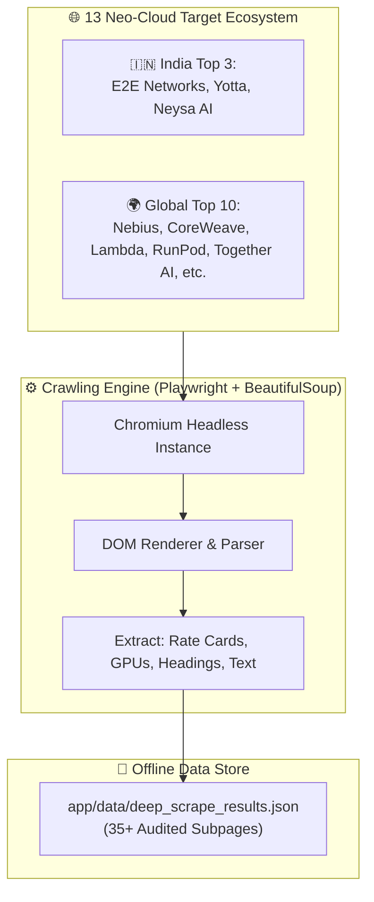
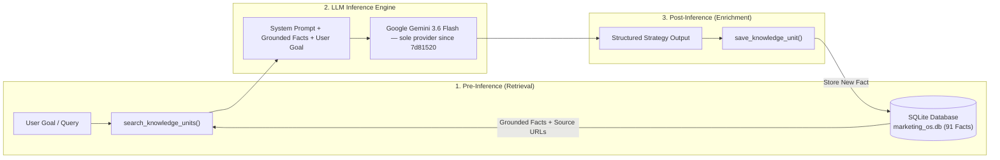
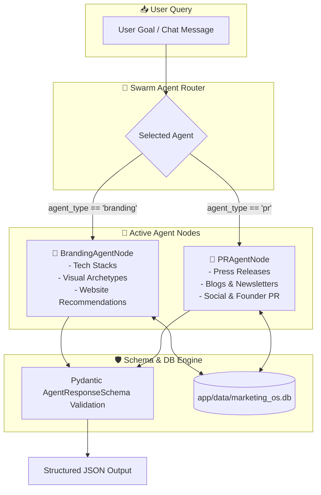
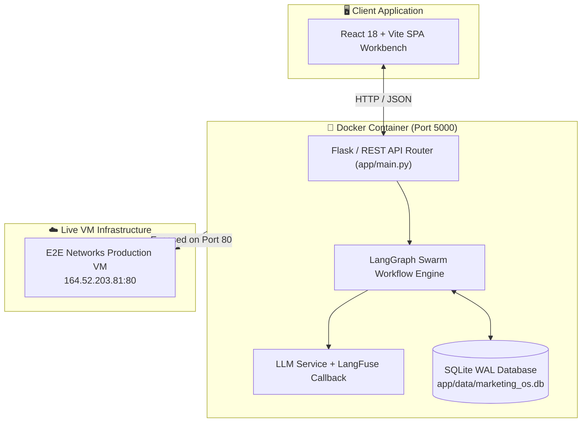
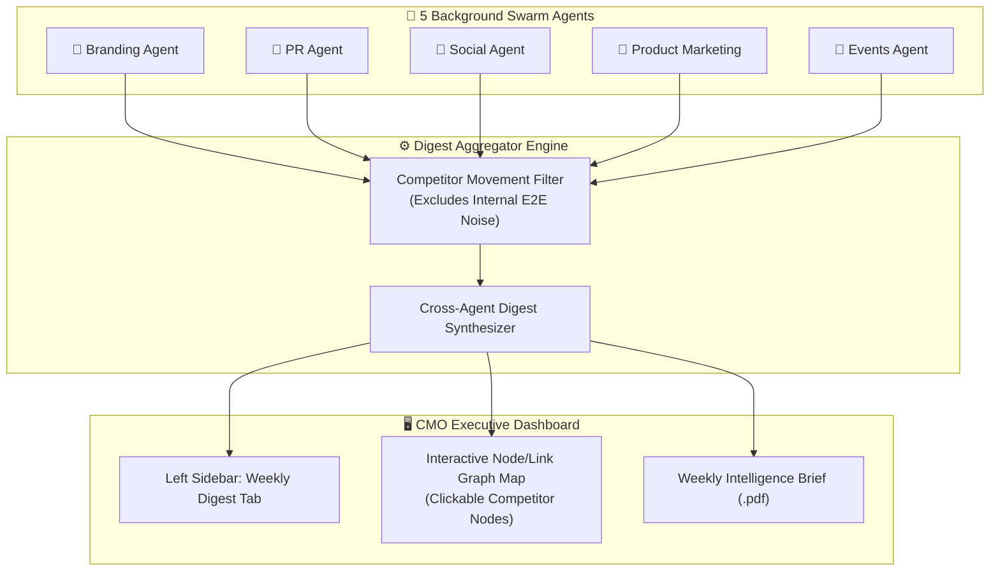
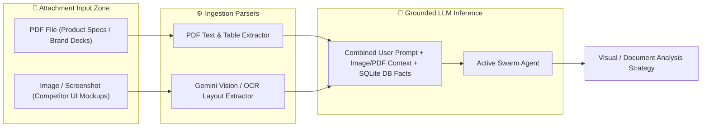
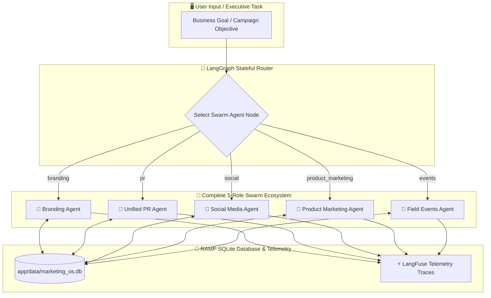
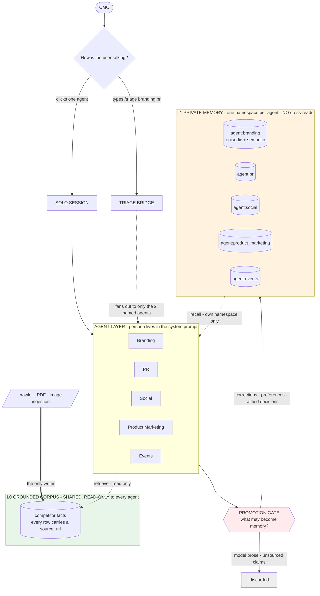
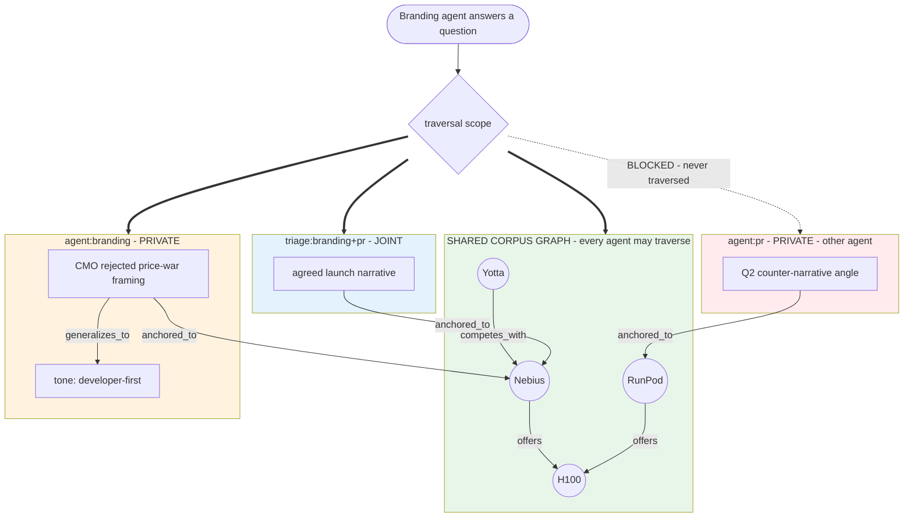
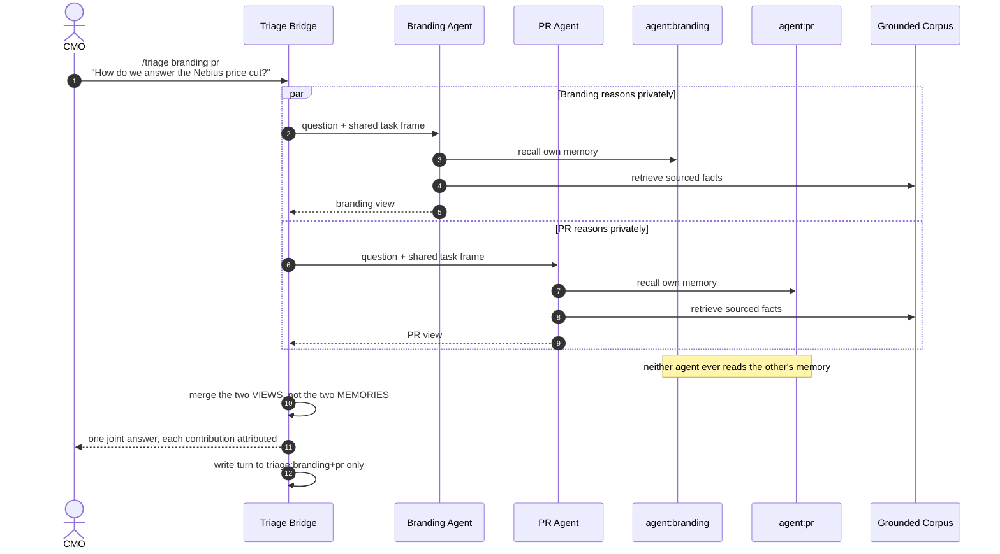

# 📐 Master System Design Document (Phases 1 – 9)
## Marketing OS v2.0 for E2E Networks

> **Document Purpose**: Production-grade architectural blueprint detailing the end-to-end multi-agent intelligence ecosystem for E2E Networks. Formatted for Claude model ingestion, developer onboarding, and executive review.

---

## 📑 System Overview & Core Philosophy

**Marketing OS v2.0** is an enterprise-grade, governed multi-agent competitive intelligence platform built for **E2E Networks** (NSE: E2E).

### Fundamental Architectural Principles:
1. **Strict Zero-Hallucination Grounding**: Every recommendation, rate card comparison, and PR counter-strategy is strictly backed by verifiable empirical facts in SQLite (`marketing_os.db`).
2. **Stateful Agent Swarm Orchestration**: Agents operate on a stateful **LangGraph State Machine** with dynamic handoffs and **LangFuse telemetry tracing**.
3. **Human-in-the-Loop Governance**: High-risk positioning moves or low-confidence decisions trigger an interactive CMO ratification banner.
4. **Modular Senior Engineering Layout**: A clean `app/` root package (`api/`, `core/`, `db/`, `graph/`, `agents/`, `services/`) with a React 18 + Vite SPA workbench.

---

## 🚩 Phase 1: Web Crawling & Multi-Page Scraping Infrastructure

### 1.1 Detailed Technical Steps:
1. **Target Ecosystem**: Audited **13 Neo-Cloud Target Organizations** (Top 10 Global + Top 3 India):
   - **India Top 3**: E2E Networks (Us), Yotta Data Services, Neysa AI.
   - **Global Top 10**: Together AI, RunPod, Lambda Labs, Nebius, CoreWeave, Crusoe Cloud, VAST Data, Voltage Park, Hyperstack, Foundry.
2. **Multi-Page Playwright Crawler (`scratch/deep_neo_cloud_scraper.py`)**:
   - Spawns Chromium Headless browser instances to navigate 35+ target subpages (`/pricing`, `/company`, `/products/*`, `/shakti-cloud`).
   - Extracts rendered DOM elements, headings (`h1`, `h2`, `h3`), hardware rate cards (`$6.99/hr`, `₹671/hr`), GPU hardware listings (`B200`, `H200`, `H100`, `L40S`), and technical text snippets.
3. **Context-Safe Data Aggregation**:
   - Saves raw JSON payloads to `app/data/deep_scrape_results.json` without polluting LLM prompt context window.

### 1.2 Mermaid Architecture Diagram:

```mermaid
flowchart TD
    subgraph Targets ["🌐 13 Neo-Cloud Target Ecosystem"]
        India["🇮🇳 India Top 3:\nE2E Networks, Yotta, Neysa AI"]
        Global["🌍 Global Top 10:\nNebius, CoreWeave, Lambda, RunPod, Together AI, etc."]
    end

    subgraph Scraper ["⚙️ Crawling Engine (Playwright + BeautifulSoup)"]
        Browser["Chromium Headless Instance"]
        DOM["DOM Renderer & Parser"]
        Extract["Extract: Rate Cards, GPUs, Headings, Text"]
    end

    subgraph Storage ["💾 Offline Data Store"]
        JSON["app/data/deep_scrape_results.json\n(35+ Audited Subpages)"]
    end

    Targets --> Browser
    Browser --> DOM
    DOM --> Extract
    Extract --> JSON
```

---

## 🚩 Phase 2: RAMP Grounded SQLite Database Engine (`marketing_os.db`)

### 2.1 Detailed Technical Steps:
1. **Database Schema (`app/db/database.py`)**:
   - Configures SQLite in Write-Ahead Logging (WAL) mode (`PRAGMA journal_mode=WAL`).
   - `knowledge_units`: `(id, organization, knowledge_class, confidence, content, source_url, enriched_by, created_at)`.
   - `decisions`: `(id, goal_statement, selected_option, confidence, escalated, reasoning_source, rationale, risks, created_at)`.
2. **Grounded Database Seeding (`app/db/grounded_seed.py`)**:
   - Reads `deep_scrape_results.json` and seeds **91 100% grounded empirical facts** into `marketing_os.db`.
   - Every single fact explicitly records its primary `source_url` (e.g. `https://www.e2enetworks.com/pricing`, `https://yotta.com/shakti-cloud/`).
3. **Zero-Hallucination Pre/Post Inference Pipeline**:
   - Pre-inference: `search_knowledge_units(query, limit=5)` queries relevant facts before calling LLMs.
   - Post-inference: `save_knowledge_unit()` dynamically enriches synthesized agent decisions back into SQLite.

### 2.2 Mermaid Architecture Diagram:

```mermaid
flowchart LR
    subgraph PreInference ["1. Pre-Inference (Retrieval)"]
        UserGoal["User Goal / Query"] --> Search["search_knowledge_units()"]
        DB[("SQLite Database\nmarketing_os.db (91 Facts)")] -->|Grounded Facts + Source URLs| Search
    end

    subgraph LLM ["2. LLM Inference Engine"]
        Search --> Prompt["System Prompt + Grounded Facts + User Goal"]
        Prompt --> Gemini["Google Gemini 3.6 Flash — sole provider since 7d81520"]
    end

    subgraph PostInference ["3. Post-Inference (Enrichment)"]
        Gemini --> Output["Structured Strategy Output"]
        Output --> Enrich["save_knowledge_unit()"]
        Enrich -->|Store New Fact| DB
    end
```

---

## 🚩 Phase 3: Core Swarm Agent Nodes (`BrandingAgentNode` & `PRAgentNode`)

### 3.1 Detailed Technical Steps:
1. **🎨 Branding Agent Node (`app/agents/branding_agent.py`)**:
   - **Scope**: Competitor tech stacks, design systems, visual design archetypes (*Enterprise-Centric* vs *Developer-Focused* vs *Research-Focused*), website design recommendations.
   - Compares E2E Networks against global and Indian Neo-Cloud landing page structures.
2. **📰 Unified PR Agent Node (`app/agents/pr_agent.py`)**:
   - **Scope**: Combines 4 media vectors: Press Releases, Company Blogs/Newsletters, Social Media (`[LinkedIn]`, `[X/Twitter]`), and Founder PR (interviews, podcast transcripts).
   - Formulates counter-narratives and media positioning briefs.
3. **Pydantic Schema Validation (`app/core/schemas.py`)**:
   - Enforces Pydantic `AgentResponseSchema` validation on all agent outputs, guaranteeing valid JSON formatting.

### 3.2 Mermaid Architecture Diagram:

```mermaid
flowchart TD
    subgraph Input ["📥 User Query"]
        Prompt["User Goal / Chat Message"]
    end

    subgraph Router ["🔀 Swarm Agent Router"]
        Select{"Selected Agent"}
    end

    subgraph Agents ["🤖 Active Agent Nodes"]
        Branding["🎨 BrandingAgentNode\n- Tech Stacks\n- Visual Archetypes\n- Website Recommendations"]
        PR["📰 PRAgentNode\n- Press Releases\n- Blogs & Newsletters\n- Social & Founder PR"]
    end

    subgraph Grounding ["🛡️ Schema & DB Engine"]
        Schema["Pydantic AgentResponseSchema Validation"]
        SQLite[("app/data/marketing_os.db")]
    end

    Prompt --> Select
    Select -->|agent_type == 'branding'| Branding
    Select -->|agent_type == 'pr'| PR

    Branding <--> SQLite
    PR <--> SQLite

    Branding --> Schema
    PR --> Schema
    Schema --> Response["Structured JSON Output"]
```

---

## 🚩 Phase 4: Production Senior Engineering Architecture & Deployment

### 4.1 Detailed Technical Steps:
1. **Modular Root Package Layout**:
   - `app/api`: REST API routes (`/api/run`, `/api/history`, `/api/health`).
   - `app/core`: Configuration (`config.py`), Pydantic schemas (`schemas.py`), primitives (`primitives.py`).
   - `app/db`: SQLite database layer (`database.py`, `grounded_seed.py`).
   - `app/graph`: LangGraph state machine (`state.py`, `workflow.py`, `handoffs.py`).
   - `app/agents`: Agent node implementations (`branding_agent.py`, `pr_agent.py`).
   - `app/services`: Unified LLM factory (`llm_service.py`) & LangFuse telemetry (`langfuse_service.py`).
2. **Automated Unit & Integration Test Suite (`tests/`)**:
   - 7 automated Pytest/Unittest cases testing SQLite operations, Pydantic validation, and API routes.
3. **Docker Container & Production VM Deployment**:
   - Multi-stage Dockerfile (Node 22 Slim frontend build + Python 3.11 Slim app runner).
   - Live production VM deployment at **[http://164.52.203.81](http://164.52.203.81)** (`HTTP 200 OK`).

### 4.2 Mermaid Architecture Diagram:

```mermaid
flowchart TD
    subgraph Client ["🖥️ Client Application"]
        SPA["React 18 + Vite SPA Workbench"]
    end

    subgraph Docker ["🐳 Docker Container (Port 5000)"]
        Flask["Flask / REST API Router (app/main.py)"]
        Workflow["LangGraph Swarm Workflow Engine"]
        Services["LLM Service + LangFuse Callback"]
        DB[("SQLite WAL Database\napp/data/marketing_os.db")]
    end

    subgraph Production ["☁️ Live VM Infrastructure"]
        VM["E2E Networks Production VM\n164.52.203.81:80"]
    end

    SPA <-->|HTTP / JSON| Flask
    Flask --> Workflow
    Workflow --> Services
    Workflow <--> DB
    Docker -->|Exposed on Port 80| VM
```

---

## 🚩 Phase 5: CMO Weekly Executive Digest & Visual Link Network UI

### 5.1 Detailed Technical Steps:
1. **Business Objective**: A CMO/CFO may only chat with 1 or 2 agents during the week. The Weekly Digest aggregates background intelligence across ALL 5 agents into a single executive dashboard.
2. **Competitor-Only Focus**: 100% focused on rival movements (Yotta, Neysa, Together AI, RunPod, Nebius, CoreWeave, etc.)—excluding internal E2E noise.
3. **Interactive Link Network Diagram**:
   - An interactive visual node/edge graph map on the React UI allowing the CMO to click on competitor nodes (e.g. *Nebius*, *RunPod*, *Yotta*) to inspect linked rate cards and news citations.
4. **Downloadable PDF Executive Report**:
   - Generates a 100% grounded **Weekly Competitor Intelligence Report (.pdf)** citing explicit source URLs.

### 5.2 Mermaid Architecture Diagram:

```mermaid
flowchart TD
    subgraph SwarmAgents ["🤖 5 Background Swarm Agents"]
        A1["🎨 Branding Agent"]
        A2["📰 PR Agent"]
        A3["🔮 Social Agent"]
        A4["🚀 Product Marketing"]
        A5["🎪 Events Agent"]
    end

    subgraph Aggregator ["⚙️ Digest Aggregator Engine"]
        Filter["Competitor Movement Filter\n(Excludes Internal E2E Noise)"]
        Synthesizer["Cross-Agent Digest Synthesizer"]
    end

    subgraph ExecutiveUI ["🖥️ CMO Executive Dashboard"]
        Tab["Left Sidebar: Weekly Digest Tab"]
        GraphMap["Interactive Node/Link Graph Map\n(Clickable Competitor Nodes)"]
        PDF["Weekly Intelligence Brief (.pdf)"]
    end

    A1 & A2 & A3 & A4 & A5 --> Filter
    Filter --> Synthesizer
    Synthesizer --> Tab
    Synthesizer --> GraphMap
    Synthesizer --> PDF
```

---

## 🚩 Phase 6: Multimodal Document & Image Ingestion Pipeline

### 6.1 Detailed Technical Steps:
1. **UI Attachment Bar (`📎 Attach PDF / Image`)**:
   - Enables users to attach PDFs (brand guidelines, product spec sheets) and Images (website UI screenshots, banner mockups) inside the ChatGPT-style prompt box.
2. **Image Vision & UI Layout Analysis**:
   - Extracts visual archetypes, color palettes, typography styles, and UI layout components from competitor website screenshots using Gemini Vision / OCR.
3. **PDF Vector Chunking & Grounded Ingestion**:
   - Extracts text blocks and tables from uploaded PDFs, chunking and storing them into the SQLite database with source citations.

### 6.2 Mermaid Architecture Diagram:

```mermaid
flowchart LR
    subgraph DropZone ["📎 Attachment Input Zone"]
        PDF["PDF File (Product Specs / Brand Decks)"]
        IMG["Image / Screenshot (Competitor UI Mockups)"]
    end

    subgraph Parsers ["⚙️ Ingestion Parsers"]
        PDF_Parser["PDF Text & Table Extractor"]
        Vision_Parser["Gemini Vision / OCR Layout Extractor"]
    end

    subgraph CombinedInference ["🤖 Grounded LLM Inference"]
        Prompt["Combined User Prompt + Image/PDF Context + SQLite DB Facts"]
        Agent["Active Swarm Agent"]
    end

    PDF --> PDF_Parser
    IMG --> Vision_Parser
    PDF_Parser & Vision_Parser --> Prompt
    Prompt --> Agent
    Agent --> Output["Visual / Document Analysis Strategy"]
```

---

## 🚩 Phase 7: Automated Competitor Change Detection & Delta Alerting (CompTrack Sync)

### 7.1 Detailed Technical Steps:
1. **Background Re-Crawler Scheduler**:
   - Runs automated periodic re-crawls (weekly/daily) of target `/pricing` and `/products` subpages.
2. **Delta Engine**:
   - Compares newly crawled subpage text against `marketing_os.db` baseline.
   - Detects price drops (e.g. B200 / H100 rate cuts), new GPU hardware launches, or website layout overhauls.
3. **Knowledge Contradiction Flagging & Alerting**:
   - Automatically flags conflicting facts and triggers an executive notification banner on the CMO dashboard.

### 7.2 Mermaid Architecture Diagram:
```mermaid
flowchart TD
    subgraph Scheduler ["⏰ Periodic Re-Crawler Scheduler"]
        Cron["Cron / Background Task Trigger"]
    end

    subgraph Crawler ["🌐 Live Re-Crawler"]
        Fetch["Fetch 13 Neo-Cloud Target Subpages"]
    end

    subgraph DeltaEngine ["⚡ Competitor Delta Engine"]
        Diff["Diff Engine: Compare with DB Baseline"]
        Detect{"Change Detected?"}
    end

    subgraph Alerting ["🚨 Notification & Database Update"]
        DB[("Update marketing_os.db")]
        Alert["Flag Knowledge Contradiction & Alert CMO Dashboard"]
    end

    Cron --> Fetch
    Fetch --> Diff
    Diff --> Detect
    Detect -->|Yes (Price cut / New GPU)| Alert
    Alert --> DB
```

---

## 🚩 Phase 8: Full Activation of Extended Swarm Agents

### 8.1 Detailed Technical Steps:
1. **🔮 Social Media Agent (`app/agents/social_agent.py`)**:
   - B2B LinkedIn campaign hooks, viral X/Twitter threads for AI developers, executive thought leadership.
2. **🚀 Product Marketing (PMM) Agent (`app/agents/product_marketing_agent.py`)**:
   - Feature battlecards against AWS/Yotta, GTM pricing tiers, and product launch positioning briefs.
3. **🎪 Events Agent (`app/agents/events_agent.py`)**:
   - Developer hackathon keynotes, enterprise roundtable briefs, booth activation demos.

### 8.2 Mermaid Architecture Diagram:

```mermaid
flowchart TD
    subgraph UserInput ["🖥️ User Input / Executive Task"]
        Goal["Business Goal / Campaign Objective"]
    end

    subgraph Router ["🔀 LangGraph Stateful Router"]
        Select{"Select Swarm Agent Node"}
    end

    subgraph FullSwarm ["🤖 Complete 5-Role Swarm Ecosystem"]
        Branding["🎨 Branding Agent"]
        PR["📰 Unified PR Agent"]
        Social["🔮 Social Media Agent"]
        PMM["🚀 Product Marketing Agent"]
        Events["🎪 Field Events Agent"]
    end

    subgraph Memory ["💾 RAMP SQLite Database & Telemetry"]
        DB[("app/data/marketing_os.db")]
        LangFuse["⚡ LangFuse Telemetry Traces"]
    end

    Goal --> Select
    Select -->|branding| Branding
    Select -->|pr| PR
    Select -->|social| Social
    Select -->|product_marketing| PMM
    Select -->|events| Events

    Branding & PR & Social & PMM & Events <--> DB
    Branding & PR & Social & PMM & Events --> LangFuse
```

---

## 🚩 Phase 9: Agent Memory Hub — Per-Agent Memory, Graph Retention & `/triage` Bridging

### 9.1 Business Objective

Today every agent is **amnesiac and promiscuous**: `/api/run` is a stateless one-shot (no
conversation), and retrieval is global — the branding agent reads the PR agent's notes because
`search_knowledge_units()` has no agent filter. Phase 9 converts Marketing OS from a
*form that returns a verdict* into **five specialists you can actually talk to**, each with its
own persistent memory that sharpens over time, plus a controlled way to put two of them in a
room together without merging their heads.

Three user-facing promises:

1. **Click an agent → talk to that agent and its memory only.** Multi-turn, persistent.
2. **It gets smarter every session** — but only from signal that came from *you*.
3. **`/triage branding pr` bridges two agents** into one answer while their memories stay
   strictly separate.

### 9.2 The gap this closes

| Capability | Today | After Phase 9 |
|---|---|---|
| Conversation | None — one-shot form, `messages[]` never written | Multi-turn threads per agent |
| Memory scope | One global pool, all agents read everything | One namespace per agent, no cross-reads |
| Learning | Agents append output; it re-enters as "grounded fact" | Promotion gate admits only user-sourced signal |
| Retrieval | Keyword top-5 over a flat table | Keyword entry + scoped graph traversal |
| Multi-agent | Digest fan-out only (M5) | `/triage` interactive bridge |

### 9.3 Four-Layer Memory Model

The governing rule: **facts are shared, interpretations are private.** Splitting the sourced
corpus five ways would produce five agents that slowly disagree about reality and would destroy
the zero-hallucination guarantee. Splitting *interpretation* is exactly what isolation means.

| Layer | Contents | Scope | Writers |
|---|---|---|---|
| **L0 — Grounded Corpus** | Scraped competitor facts, every row `source_url`-backed | Shared, **read-only to agents** | Crawler + Phase 6 ingestion only |
| **L0.5 — Corpus Graph** | Entities (competitors, GPU SKUs) + relations | Shared, read-only | Deterministic extractor |
| **L1 — Private Agent Memory** | Episodic turns + distilled semantic facts | **One namespace per agent** | That agent, via the promotion gate |
| **L2 — Joint Triage Memory** | What an agent *pair* agreed | Namespace per pair | `/triage` sessions only |

Memory tiers inside L1 follow the episodic → semantic → procedural taxonomy the field converged
on: **episodic** (raw turns, decays), **semantic** (distilled preferences, persists),
**procedural** (the agent's persona/prompt — evolves only with human approval).

### 9.4 Namespace Convention (`containerTag`-shaped)

Namespaces are deterministic strings derived from IDs we already hold, so the right namespace is
always reconstructible at query time without a lookup:

```
agent:branding                  → branding's private memory
agent:pr                        → PR's private memory
triage:branding+pr              → joint memory for that pair (members sorted, so the tag is stable)
corpus:global                   → the shared grounded layer
```

Pattern `^[a-zA-Z0-9_:+-]+$`. This mirrors supermemory's `containerTag` deliberately: the
storage layer stays SQLite, but the *interface* (`add(namespace, …)` / `search(namespace, …)`)
is shaped so an external memory engine becomes a backend swap rather than a redesign.

### 9.5 The Promotion Gate (what is allowed to become memory)

Not everything an agent says is worth remembering. Unfiltered self-write is the documented
failure mode — *temporal memory contamination*, where each decision made on poisoned memory
generates further poisoned memories. **This project has already hit that bug once:** M5 required
`enriched_by NOT LIKE '%agent%'` to stop agent output being cited back as grounded fact.

| Admitted → written to L1 | Rejected → discarded |
|---|---|
| User corrections ("no, never frame it as a price war") | Model prose and restated summaries |
| Stated preferences ("developer-first tone") | Unsourced factual claims |
| CMO-ratified decisions | One-off chatter |

Every admitted memory carries `provenance` (which turn produced it), `tier`
(episodic/semantic), and `confidence`. Promotion from episodic → semantic requires
**repetition** (the standard heuristic: recurring across 3+ sessions), never a single mention.
Agents may **never** write to L0 — that boundary is what keeps "100% grounded" true.

### 9.6 Graph Layer & Scoped Traversal

The graph is a **retrieval** structure, not an admission policy — it raises recall on what
already passed the gate, it does not lower the bar. Graph retrieval also brings a governance
benefit: a traversal path is *auditable evidence*, which similarity scores are not.

Three edge classes, and traversal is scoped by namespace:

| Edge class | Example | Who may traverse |
|---|---|---|
| **Corpus** | `Nebius --offers--> H100` | Every agent |
| **Private** | `"CMO rejected price-war framing" --anchored_to--> Nebius` | Owning agent only |
| **Joint** | created during `/triage` | The pair only |

An agent traverses **shared ∪ its own private ∪ its own joint**. It never traverses another
agent's private edges. Memory→corpus anchors are **one-directional**: you can walk from your own
memory into a shared fact, never from a shared fact into someone else's memory. Without this
rule the graph silently re-opens the exact leak `/triage` exists to prevent.

**Corpus entities are extracted deterministically** from the known taxonomy (13 tracked
competitors; GPU SKUs B200/H200/H100/A100/L40S/HGX) — *not* by an LLM. A fabricated edge is
worse than a missing one, because a graph path *looks* like evidence. LLM extraction is
permitted only for L1 memory nodes, which are gated anyway.

This also completes the M5 ceiling: the competitor network stops being hub-and-spoke and becomes
a real network once shared-SKU relations exist.

### 9.7 `/triage` Protocol — merge the answers, never the memories

```
/triage branding pr   How do we answer the Nebius price cut?
```

1. Bridge fans the question out to **only** the two named agents.
2. Each reasons **privately**: own namespace + shared corpus. Neither sees the other's memory.
3. Bridge merges the two **views** (structured outputs), attributing each contribution.
4. The turn is written to `triage:branding+pr` — **neither private namespace is touched.**

Step 4 is the load-bearing decision. Writing back into both private memories would create the
cross-contamination `/triage` exists to prevent, merely delayed by one turn. The pair instead
accumulates its own shared history over time.

> Industry corroboration: supermemory's v4 API **cannot** query across containers in one request
> — *"you must make separate queries and merge results in your application logic."* The
> constraint and this design are the same shape.

### 9.8 Conversation Layer

- `POST /api/chat` — `{namespace, thread_id, message}` → agent reply, multi-turn.
- Threads persist per agent; `SwarmState.messages` finally carries real turns.
- **Recall is visible, not silent.** Each reply reports which memories and which grounded facts
  it drew on — following Claude's memory design (explicit tool-call recall) over ChatGPT's
  implicit always-on injection. For a CMO-facing product that must defend where a
  recommendation came from, visible recall is a governance feature, consistent with the
  escalation gate already in the graph.

### 9.9 Mermaid Architecture Diagrams

**9.9.1 — Memory architecture**


```mermaid
flowchart TB
    User(["CMO"])
    User --> Sel{"How is the user talking?"}
    Sel -->|"clicks one agent"| Solo["SOLO SESSION"]
    Sel -->|"types /triage branding pr"| Bridge["TRIAGE BRIDGE"]

    subgraph AL ["AGENT LAYER - persona lives in the system prompt"]
        direction LR
        A1["Branding"]
        A2["PR"]
        A3["Social"]
        A4["Product Marketing"]
        A5["Events"]
    end

    Solo --> AL
    Bridge -.->|"fans out to only the 2 named agents"| AL

    subgraph PM ["L1 PRIVATE MEMORY - one namespace per agent - NO cross-reads"]
        direction LR
        M1[("agent:branding<br/>episodic + semantic")]
        M2[("agent:pr")]
        M3[("agent:social")]
        M4[("agent:product_marketing")]
        M5[("agent:events")]
    end

    subgraph GC ["L0 GROUNDED CORPUS - SHARED, READ-ONLY to every agent"]
        C[("competitor facts<br/>every row carries a source_url")]
    end

    Ingest[/"crawler · PDF · image ingestion"/] ==>|"the only writer"| C
    AL -.->|"retrieve - read only"| C
    PM -.->|"recall - own namespace only"| AL

    AL --> PG{{"PROMOTION GATE<br/>what may become memory?"}}
    PG -->|"corrections · preferences · ratified decisions"| PM
    PG -->|"model prose · unsourced claims"| Drop["discarded"]

    style GC fill:#e8f5e9
    style PM fill:#fff3e0
    style PG fill:#ffebee
    style Drop fill:#eeeeee
```

**9.9.2 — Scoped graph traversal**


```mermaid
flowchart TB
    Q(["Branding agent answers a question"]) --> T{"traversal scope"}

    subgraph SG ["SHARED CORPUS GRAPH - every agent may traverse"]
        direction LR
        N1(("Nebius"))
        N2(("H100"))
        N3(("RunPod"))
        N4(("Yotta"))
        N1 -->|offers| N2
        N3 -->|offers| N2
        N4 -->|competes_with| N1
    end

    subgraph MB ["agent:branding - PRIVATE"]
        B1["CMO rejected price-war framing"]
        B2["tone: developer-first"]
        B1 -->|generalizes_to| B2
    end

    subgraph MJ ["triage:branding+pr - JOINT"]
        J1["agreed launch narrative"]
    end

    subgraph MP ["agent:pr - PRIVATE - other agent"]
        P1["Q2 counter-narrative angle"]
    end

    T ==> SG
    T ==> MB
    T ==> MJ
    T -.->|"BLOCKED - never traversed"| MP

    B1 -->|anchored_to| N1
    J1 -->|anchored_to| N1
    P1 -->|anchored_to| N3

    style SG fill:#e8f5e9
    style MB fill:#fff3e0
    style MJ fill:#e3f2fd
    style MP fill:#ffebee
```

**9.9.3 — `/triage` interaction**


```mermaid
sequenceDiagram
    autonumber
    actor U as CMO
    participant B as Triage Bridge
    participant BA as Branding Agent
    participant PA as PR Agent
    participant MB as agent:branding
    participant MP as agent:pr
    participant C as Grounded Corpus

    U->>B: /triage branding pr<br/>"How do we answer the Nebius price cut?"

    par Branding reasons privately
        B->>BA: question + shared task frame
        BA->>MB: recall own memory
        BA->>C: retrieve sourced facts
        BA-->>B: branding view
    and PR reasons privately
        B->>PA: question + shared task frame
        PA->>MP: recall own memory
        PA->>C: retrieve sourced facts
        PA-->>B: PR view
    end

    Note over MB,MP: neither agent ever reads the other's memory
    B->>B: merge the two VIEWS, not the two MEMORIES
    B-->>U: one joint answer, each contribution attributed
    B->>B: write turn to triage:branding+pr only
```

### 9.10 Data Model (additive — no existing table changes)

```
memories(id, namespace, tier, content, provenance, confidence,
         source_turn_id, hit_count, created_at, last_used_at)

edges(id, src, rel, dst, namespace, provenance, created_at)
      -- namespace 'corpus:global' = shared; 'agent:*' / 'triage:*' = scoped

threads(id, namespace, title, created_at)
turns(id, thread_id, role, content, recalled_ids, created_at)
```

Graph traversal uses SQLite **recursive CTEs** — no Neo4j. At this scale (94 corpus facts, 13
organizations, hundreds of memories) a dedicated graph database is pure ceremony, and SQLite is
documented as appropriate for small-to-medium graph workloads.

### 9.11 Design decisions & rationale

| Decision | Why | Rejected alternative |
|---|---|---|
| Shared corpus + private memory | Hybrid private/shared is the production default; facts are objective, interpretations are not | 5 full copies → 5x duplication, guaranteed drift |
| Namespace isolation, not filtered index | Separate namespaces are structural; filtering a shared index is a policy you can get wrong | one table + `WHERE agent = ?` |
| Gate admits user-sourced signal only | Prevents temporal memory contamination; the M5 bug proves it's real here | write-everything with TTL |
| Graph in SQLite | Already the stack; recursive CTEs suffice at this size | Neo4j / FalkorDB |
| Deterministic corpus extraction | A fabricated edge looks like evidence | LLM entity extraction over the corpus |
| `/triage` writes to joint namespace only | Writing to both private memories re-creates the leak, one turn later | write-back to each agent |
| Build on SQLite, `containerTag`-shaped API | 94 facts vs supermemory's 100B tokens/month; avoids a Node+Postgres service beside Flask | adopt supermemory now |
| Visible recall | Auditability; consistent with the CMO escalation gate | silent context injection |

**Research sources:** [Microsoft Multi-Agent Reference Architecture](https://microsoft.github.io/multi-agent-reference-architecture/docs/memory/Short-Term-Memory.html) ·
[mem0 — Multi-Agent Memory Systems](https://mem0.ai/blog/multi-agent-memory-systems) ·
[LangChain — Long-term memory](https://docs.langchain.com/oss/python/langchain/long-term-memory) ·
[Agent Memory Architecture: the three-tier pattern](https://appscale.blog/en/blog/agent-memory-architecture-episodic-semantic-procedural-the-three-tier-pattern-2026) ·
[supermemory — Container Tags](https://supermemory.ai/docs/concepts/container-tags) ·
[supermemory issue #27 — per-agent isolation (open)](https://github.com/supermemoryai/openclaw-supermemory/issues/27) ·
[Redis — Knowledge graph RAG](https://redis.io/blog/knowledge-graph-rag-structured-retrieval-ai-agents/) ·
[SQLite as a graph database](https://dev.to/rohansx/sqlite-as-a-graph-database-recursive-ctes-semantic-search-and-why-we-ditched-neo4j-1ai) ·
[Simon Willison — Claude vs ChatGPT memory](https://simonwillison.net/2025/Sep/12/claude-memory/) ·
[MintMCP — memory poisoning](https://www.mintmcp.com/blog/ai-agent-memory-poisoning)

### 9.12 UI

The per-agent chat and `/triage` view are a genuine layout change, so the background is
re-based at the same time: replace the hand-written three.js simplex shader in
`ShaderCanvas.jsx` with **`@shadergradient/react`** (`npm i @shadergradient/react
@react-three/fiber three three-stdlib camera-controls`), using `ShaderGradientCanvas` +
`ShaderGradient`. Per-agent accent colours can key off the same gradient config so each agent's
session is visually distinct.

### 9.13 Build Milestones

Phase 9 ships as six atomic commits, bottom-up. Each is independently testable and leaves
the suite green; nothing is half-wired between commits.

| # | Milestone | Deliverable | Proves | Status |
|---|---|---|---|---|
| **M9.1** | Memory store | `memories` / `threads` / `turns` tables, `app/memory/store.py`, namespace algebra | **The isolation rule** — an agent reads shared ∪ own private ∪ own joint, nothing else | ✅ `c05eaa3` |
| **M9.2** | Promotion gate | `app/memory/gate.py` — admission classifier, provenance, episodic→semantic on repetition | Model prose never becomes memory | ✅ `07a4c66` — **superseded by M9.7, see below** |
| **M9.3** | Conversation layer | `POST /api/chat`, per-agent threads, memory-aware `run_agent`, visible recall | Agents are multi-turn and stateful | ✅ `1adfbd1` |
| **M9.4** | Graph & scoped traversal | `edges` table, deterministic corpus extraction, recursive-CTE traversal | Traversal cannot hop into another agent's private memory | ✅ `1d0e28f` |
| **M9.5** | `/triage` bridge | `POST /api/triage`, 2-agent parallel fan-out, attributed merge, joint-namespace write | Neither private namespace is touched | ✅ `fb10aa1` |
| **M9.6** | UI | Per-agent chat panel, `/triage` composer, memory inspector, `@shadergradient/react` swap | The CMO can actually use it | 🔵 **Not started — next** |

Order rationale: the isolation rule is the part most likely to have a subtle flaw, so it is
built and tested **first, once, in one place** rather than discovered after five agents and a
bridge already depend on it. M9.3 is the first commit that is user-visible end to end.

**M9.4 as built.** Two notes where the implementation is narrower than the section above.
Corpus extraction is fully deterministic: the organisation comes from the row's own
`organization` column and SKUs from a fixed taxonomy, so no edge is ever inferred by a
model — a fabricated edge is worse than a missing one, because a traversal path *looks*
like evidence. And there is no asserted `competes_with` relation; rival↔rival is a derived
2-hop result through a shared SKU (`Nebius -prices-> H100 <-offers- RunPod`), which also
lifts M5's hub-and-spoke ceiling in `build_network()` with links that name their evidence.
`rebuild_corpus_graph()` replaces rather than tops up `corpus:global` — the seeder DROPs
`knowledge_units`, so surviving edges would cite ids that no longer exist. Memory anchors
in `agent:*` / `triage:*` are untouched by a reseed.

**M9.5 as built.** Both agents reason through the same `recall_for()` the solo chat path
uses, so "shared ∪ own private ∪ own joint" is decided in one function rather than
reimplemented for the bridge — a second copy is how the two would drift apart. Bounded to
exactly two agents on purpose: the merge attributes two named positions and the namespace
algebra sorts two members, so an n-way bridge is a different product decision (who
arbitrates disagreement?), not a loop bound to raise. The merge is told to surface
disagreement rather than average it — two specialists pulling against each other is
information the CMO needs — and its fallback returns both views verbatim and attributed,
because losing the synthesis is acceptable while inventing a consensus is not. A thread
is pinned to its pair, so one pair's history cannot be filed under another's.
`?agents=a,b` on `/api/memory` and `/api/chat/threads` resolves to the *joint* namespace,
never to a union of the two private ones.

### 9.14 Explicitly out of scope (deferred ceilings)

- **No embeddings / vector search.** Keyword entry + graph traversal first; add vectors only
  when keyword recall measurably fails. FTS5 is the cheaper next step. *(M9.9 puts a number on
  "measurably" — until then this bullet was an assertion, not a finding.)*
- **No cross-agent auto-learning.** Agents never learn from each other implicitly — only
  through an explicit `/triage`. **Still true after M9.7:** an agent may now write to *its own*
  memory, never to another's.
- **No automatic forgetting beyond episodic decay.** Contradiction resolution stays manual until
  there is evidence it's needed.
- **No agent-authored persona changes.** Procedural memory (the system prompt) changes only with
  human approval. **Unchanged by M9.7** — reflections are episodic/semantic rows, never persona.

### 9.15 M9.7 — Self-evolving memory (supersedes M9.2 rule 1)

**User decision, 2026-07-26.** M9.2's rule 1 — *only user turns are candidates for memory* —
is reversed. The agent decides what it commits to its own memory, so the layer can learn from
prior interactions instead of only recording what it was told.

The reversal is safe only with the guardrail attached, because the failure mode is documented:
self-evolving agents over-trust their own reflections and distil *locally correct but
non-transferable* experience into over-generalised standing rules, which then self-reinforce as
each use raises their rank. Answer one Nebius pricing question well, write "undercut on price
when a rival cuts," and six months later that is strategy the CMO never approved.

Three mechanisms, all reusing parts that already exist:

| Mechanism | Implementation | Source |
|---|---|---|
| **Provenance tiers** | `user` / `reflection` / `lesson` on the existing `provenance` column. A `reflection` never outranks a `user` row at recall and is shown to the model as *"I previously concluded X"*, never as an instruction. | — |
| **No promotion across tiers** | `CHECK` constraint: a reflection can never become `user`. Not by repetition, not by hit count. The two sources stay distinguishable permanently. | — |
| **Consensus validation** | Before a reflection is written, compare it against its own graph neighbourhood via the existing `recall_by_graph()`. A structural outlier is not written. | A-MemGuard (arXiv 2510.02373) — >95% attack-success reduction, minimal utility cost |
| **Lesson memory** | Contradicted reflections are distilled into a separate `lesson` tier, consulted *before* answering rather than merged into the answer. | A-MemGuard dual-memory |

**M9.7 ships with its own metrics or it does not ship.** Gate precision/recall, reported
separately for `user` and `reflection` provenance. Without them a self-evolving memory layer is
unfalsifiable — it will feel like it is learning whether or not it is.

### 9.16 M9.8–M9.10 — instrumentation, retrieval, deferred

| # | Milestone | Contents | Gate to start |
|---|---|---|---|
| **M9.8** | Evaluation harness | Retrieval gold set (~50 queries) → Recall@5 / Precision@5 / **F2@5** / MRR. Deterministic groundedness: every number, price, date and URL in an answer must appear verbatim in the retrieved facts — hard fail, not a score. Doc/diagram reconciliation. LangSmith removal. Load test on the VM. | M9.7 merged |
| **M9.9** | Retrieval upgrade | FTS5 replacing `LIKE`. Cross-domain hint (deterministic keyword overlap → suggests `/triage`, never auto-escalates). | M9.8 baseline exists |
| **M9.10** | Deferred, trigger-gated | Claim-level faithfulness judge; hybrid embeddings *(trigger: FTS5 Recall@5 < 0.85)*; semantic consensus triples *(trigger: M9.7 gate precision ≥ 0.9)*; N-way `/triage` *(trigger: an arbitration rule is chosen)*. | Its own trigger fires |

**F2 not F1.** A missed fact makes the agent answer ungrounded; a surplus fact costs tokens.
F1 weights those equally. They are not equal, so recall carries 2×.

---

## 📊 Complete Phase Roadmap Summary Table

| Phase | Milestone Name | Status | Key Deliverables |
|---|---|---|---|
| **Phase 1** | Web Crawling & Scraping | ✅ Complete | Scraped 35+ subpages across 13 Neo-Clouds (`deep_scrape_results.json`) |
| **Phase 2** | RAMP Grounded SQLite Engine | ✅ Complete | `marketing_os.db` seeded with 94 100% grounded facts & source URLs |
| **Phase 3** | Core Swarm Agent Nodes | ✅ Complete | Active Branding & PR Agents with Pydantic schema validation |
| **Phase 4** | Senior Engineering Layout & Deployment | ✅ Complete | Clean `app/` root, 7 Pytest cases, deployed on VM (`164.52.203.81`) |
| **Phase 5** | CMO Weekly Executive Digest UI | ⚠️ Complete (one gap) | LangGraph fan-out digest across all 5 agents, interactive link graph, **markdown** export with cited sources. **PDF export was specified and never built** — `/api/export/markdown` is the only export route. Digest tab has never been visually verified in a browser. |
| **Phase 6** | Multimodal Image & PDF Ingestion | 📍 Planned | Prompt attachment button (`📎`), Gemini Vision OCR, PDF text chunking |
| **Phase 7** | Automated Change Tracking (CompTrack) | 📍 Planned | Background re-crawler, competitor delta engine, CMO contradiction alerts |
| **Phase 8** | Full Activation of Swarm Agents | ✅ Complete | All 5 agents live in `AGENT_REGISTRY`; all five run in the M5 digest fan-out |
| **Phase 9** | Agent Memory Hub & `/triage` Bridging | 🔵 **In progress — backend done, UI not started** | M9.1–M9.5 committed (`c05eaa3` → `fb10aa1`): namespace store, promotion gate, chat layer, scoped graph, `/triage` bridge. **M9.6 UI not started — the frontend makes zero calls to `/api/chat`, `/api/triage` or `/api/memory`, so none of it is reachable from the product.** |

> **Build order (user decision, 2026-07-25): Phase 9 is next.** Phases 6 and 7 are deferred
> behind it. They are independent of Phase 9 (both write to the L0 shared corpus, which the
> memory work does not touch), so they can follow in any order afterwards.
>
> **Status honesty note (2026-07-26).** This table previously read "Phase 9 = NEXT" while five
> of its six milestones were already committed, and claimed a PDF export that was never built.
> Both are corrected above. The rule going forward: a row is ✅ only when a reachable code path
> exists, not when the module compiles. Phase 9's backend compiles and is tested; it is not
> reachable, so it is 🔵 not ✅.
